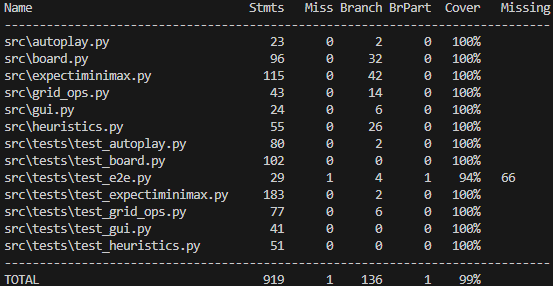

# 2048 – Expectiminimax AI (Python)

Tämä projekti on **2048-pelin Python-toteutus**, jossa on mukana **tekoäly**, joka pelaa peliä käyttäen **Expectiminimax-hakualgoritmia**.  
Koodi on jaettu loogisiin moduuleihin, ja testit kattavat lähes koko toteutuksen (`~99 %` testikattavuus).

---

## Ominaisuudet

- **Tekstipohjainen käyttöliittymä** (`cli.py`)
- **Tekoäly (Expectiminimax)** – arvioi siirrot heuristiikkojen ja todennäköisyyksien avulla  
- **Automaattinen pelinsimulaattori** (`autoplay.py`)
- **Optimoitu hakualgoritmi**
  - Dynaaminen syvyys (riippuu tyhjistä ruuduista ja suurimmasta laatasta)
  - Välimuistit (arvio- ja hakukeskeiset)
  - Siirtojen järjestys ennakkoarvion perusteella
  - “Ohennettu” CHANCE-solmu – nopeampi laskenta
- **Heuristiikat**:
  - Tyhjät ruudut
  - Monotonicity (“käärme”-pisteytys)
  - Smoothness (tasaisuus)
  - Merge-potential (yhdistymispotentiaali)
  - Corner-bonus (kulmissa olevat isot laatat)

---

## Rakenne

```
src/
├── autoplay.py        # Suorittaa tekoälypelin automaattisesti
├── board.py           # Pelilauta, siirrot ja pistelaskenta
├── cli.py             # Tekstipohjainen käyttöliittymä (WASD, AI, Q)
├── expectiminimax.py  # Expectiminimax-hakualgoritmi
├── grid_ops.py        # Puhtaat siirtofunktiot ilman GameStatea
├── gui.py             # Tulostus ja komentolukeminen
└── heuristics.py      # Heuristiikkafunktiot (evaluate, smoothness, jne.)
tests/
├── test_board.py
├── test_expectiminimax.py
├── test_grid_ops.py
└── test_heuristics.py
```

---

## Käyttö

### Käynnistä tekstipeli (manuaalinen pelaaminen)

```bash
python -m src.cli
```

**Ohjaus:**
- `W` / `A` / `S` / `D` – liiku ylös/vasemmalle/alas/oikealle  
- `ai` – tekoäly tekee yhden siirron  
- `q` – lopeta peli

---

### Käynnistä automaattinen tekoälypeli

```bash
python -m src.autoplay --depth 5
```

**Argumentit:**
- `--depth` – haun syvyys (oletus: `4`)  
  Suurempi arvo tekee tekoälystä vahvemman, mutta hitaamman.

---

## Testaus

Testit on kirjoitettu `pytest`-kirjastolla, ja kattavuus mitattu `coverage`-työkalulla.

**Aja kaikki testit:**
```bash
pytest
```

**Luo kattavuusraportti:**
```bash
pytest --cov=src --cov-report=term-missing
```

Kattavuus:  
- Kokonaiskattavuus: **~99 %**
- Testattu mm.:
  - Heuristiikat ja evaluointi
  - Siirtologiikka (`grid_ops`, `board`)
  - Expectiminimaxin hakurakenne, välimuistit ja dynaaminen syvyys
  - AI:n päätöksenteko ja “parhaan siirron” valinta

---

## Esimerkkikuva (kattavuusraportti)



---

## Riippuvuudet

- Python 3.11+
- pytest
- coverage (valinnainen, raportointiin)

Asennus:
```bash
pip install -r requirements.txt
```