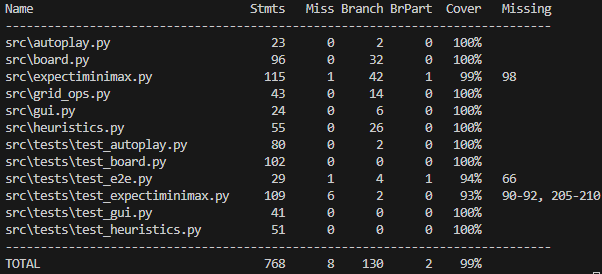

# Testausdokumentti

## Yksikkötestauksen kattavuusraportti

Projektin testaus on toteutettu Pythonin `pytest`-kirjastolla. Koodin testikattavuus on mitattu `coverage`-työkalulla. Alla oleva kuva (`test_coverage.png`) näyttää yksityiskohtaisen kattavuusraportin:



Kattavuus:
- Kokonaiskattavuus: **~99 %**
- Suurin osa moduuleista (autoplay, gui, heuristics, test-moduulit) saavutti **100 % kattavuuden**.
- Pieni osa riveistä jäi testaamatta `board.py`, `expectiminimax.py` ja `minimax.py` -moduuleissa. Nämä rivit liittyvät lähinnä harvinaisempiin pelitilanteisiin ja karsinnan sisäisiin ehtoihin.

## Mitä on testattu ja miten?

- **Pelilauta (board.py)**  
  Testattu mm. uusien pelien luonti, siirtojen toimivuus, pisteiden päivitys sekä satunnaisen laatan lisääminen.  
  Testeissä varmistetaan, että siirrot toimivat oikein eri suunnissa ja että tilapäivitys on konsistentti.

- **Heuristiikat (heuristics.py)**  
  Testattu yksittäiset heuristiikkafunktiot (esim. tyhjien ruutujen laskeminen, snake-score, smoothness).  
  Varmistetaan, että heuristiikka antaa odotetun numeerisen arvon annetuilla ruudukoilla.

- **Tekoälyalgoritmit (expectiminimax.py, minimax.py)**  
  Testattu seuraavat:
  - Hajautusavainten (`make_key`) deterministisyys.  
  - Lehtisolmujen arvonlaskenta (`leaf_value`).  
  - Dynaamisen hakusyvyyden sääntöjen toimivuus.  
  - Parhaan siirron valinta eri tilanteissa (`best_move_expecti`, `best_move_minimax`).  
  - Välimuistin (transpositiotaulu/cache) käyttö ja osumat.  
  - Katkaisujen (alpha-beta pruning) vaikutus tallennukseen.

- **Tekstipohjainen käyttöliittymä (gui.py, cli.py)**  
  Testattu mm.:
  - Pelilaudan tulostus oikeassa muodossa (`render`).  
  - Komentojen lukeminen käyttäjältä eri syötteillä (`read_command`).  
  - Tekoälyn siirron suoritus (`ai_step`).  
  - Loppuviestien ja siirtoviestien tulostus (`print_ai_move`, `print_final`).  

- **Automaattipeli (autoplay.py)**  
  Testattu automaattipelin käynnistyminen ja pelin kulku tekoälyllä.

## Millaisilla syötteillä testaus tehtiin?

- Pienet, käsin rakennetut peliruudukot (esim. tyhjät ruudut, yksi numero, täysi ruudukko ilman siirtoja).  
- Epäsäännölliset pelitilat, joissa tarkistettiin heuristiikan arvot.  
- Erityistapaukset:
  - Ei mahdollisia siirtoja (peli ohi).  
  - Täysi ruudukko ilman tyhjiä ruutuja.  
  - Pelitila, jossa tekoälylle on tarjolla vain yksi oikea siirto.  
  - Satunnaisvaihtoehdot (2 tai 4 lisättynä) min-solmujen testauksessa.  

## Miten testit voidaan toistaa?

Testit voidaan suorittaa projektin juuressa komennolla:

```bash
coverage run --branch -m pytest src
coverage report -m
